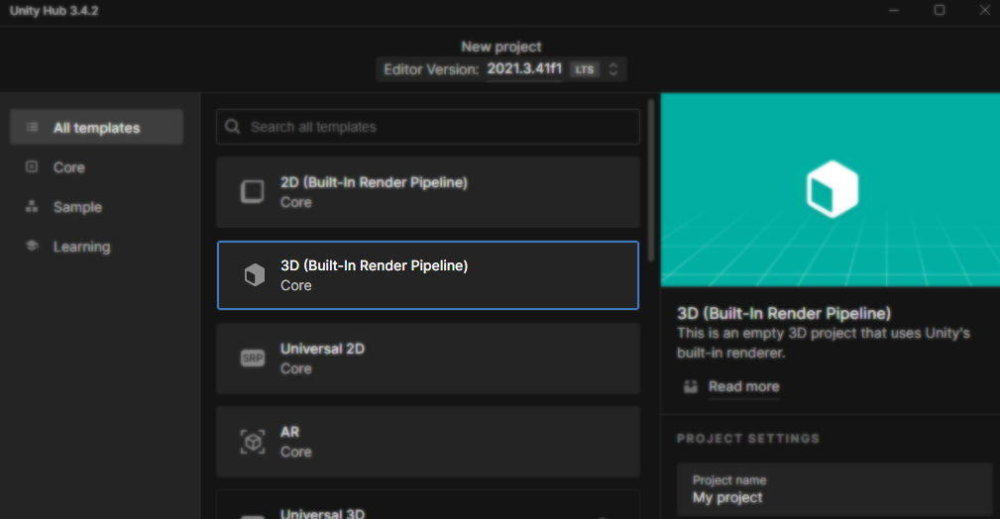
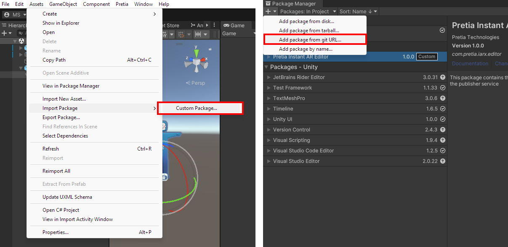

# Unity Exporter

The **Pretia Exporter** is a Unity Editor extension that allows creators to export complex asset setups directly into their Pretia AR asset library. This tool streamlines the process of preparing and uploading assets such as particle systems, animated prefabs, UI elements, and more, enabling richer, more dynamic AR experiences.

Please refer to the Pretia AR Docs for further information about the Pretia Exporter and Pretia AR: https://docs.pretiaar.com/

## Setup

1. Install Unity version 2021.3.x
    - You can install via the [Unity Hub](https://unity.com/download) or manual download
    - We recommend version [2021.3.41f1](https://unity.com/releases/editor/whats-new/2021.3.41)
      - Simply [click here](unityhub://2021.3.41f1/6c5a9e20c022) if you have the Unity Hub installed to install [2021.3.41f1](unityhub://2021.3.41f1/6c5a9e20c022)
2. Create a new Unity project, or open an existing project
    - Ensure you are using the Built-In Render Pipeline
    - We recommend just using the Core `3D (Built-In Render Pipeline)` template if you are creating a new project

3. Add the Pretia AR Exporter package
    - You may choose to either [download and import the package from here](https://pretiaar.com/downloads/pretia-ar-exporter-latest.unitypackage)
    - Or add the project via the Unity Package Manager
      - Press the `+` icon in the top left corner of the package manager window, and `Add package from git URL...`
      - Then use the following URL: `https://github.com/pretia/pretia-ar-exporter.git`
    - Use whichever method you prefer

4. Continue to learn how to export your assets for use in Pretia AR
    - [Exporting Your First Asset](https://docs.pretiaar.com/docs/unity-exporter/exporting-your-first-asset)

## Notes

Thanks to needle-tools for their unity-deeplink project, which has been used to streamline Pretia's authentication system. You can find the original repository here:

https://github.com/needle-tools/unity-deeplink ([LICENSE](https://github.com/needle-tools/unity-deeplink/blob/main/package/Editor/Plugins/Needle.Deeplink.Harmony.License.md))